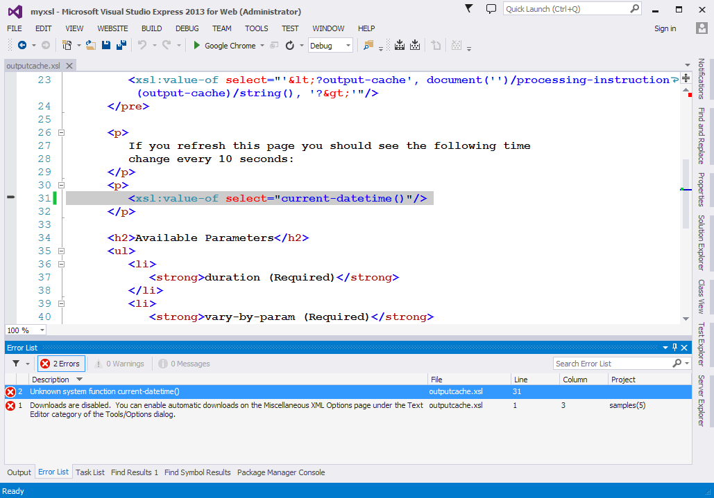
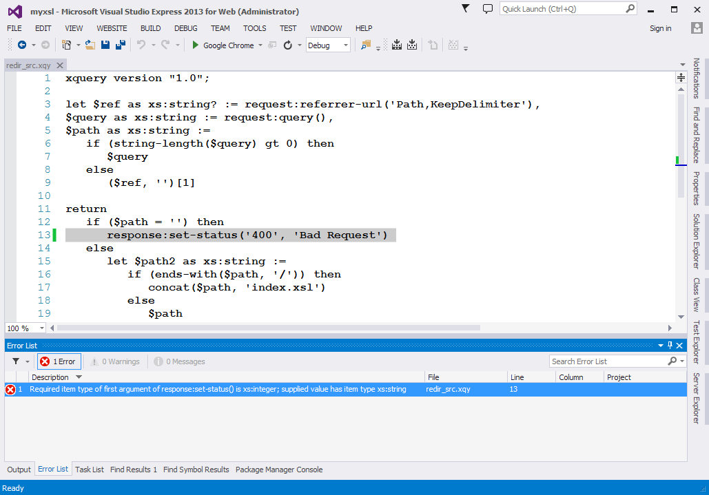

[myxsl]
=======

> **Note: Development of myxsl has ceased in favor of [XCST]**

**myxsl** (formerly myxsl.net) helps you integrate XPath-based languages such as XSLT, XQuery, Schematron with your .NET code.

myxsl supports [XslCompiledTransform] and [Saxon-HE]. A provider design enables for other processors to plug-in.

This project is still on alpha stage. Some features are more stable than others. So far, the only released feature is the view engines for ASP.NET MVC.

[](https://www.nuget.org/packages/XsltViewEngine)
[](https://www.nuget.org/packages/SaxonViewEngine)

Web pages
---------
myxsl provides dynamic compilation using build providers. After adding some [configuration in Web.config](samples/web.config) you can add `.xsl` and `.xqy` pages to your web site.

### Compilation

myxsl provides compile-time notification of static errors in Visual Studio. Just click 'Build Website' (Ctrl+Shift+B) and watch the 'Error List' pane.





### Directives

Similar to `.aspx` pages, you can use directives, in the form of processing instructions with pseudo attributes, to configure various aspects of your web page, e.g.:

```xml
<?xml version="1.0" encoding="utf-8"?>
<?page validate-request="false" enable-session-state="false" ?>
<?output-cache duration="60" vary-by-param="none" ?>

<xsl:stylesheet version="1.0" xmlns:xsl="http://www.w3.org/1999/XSL/Transform">
   ...
```

### MVC

myxsl integrates with ASP.NET MVC by implementing view engines for XSLT and XQuery. The ViewData dictionary items are passed as XSLT global parameters and XQuery external variables, and the model object is converted to XML and used as initial context node.

Function library
----------------
myxsl includes a function library for Request/Response/Session etc., as well as extensions specific to XslCompiledTransform and Saxon-HE. Also, some EXPath modules are implemented. Please run the [samples](samples) project for more information.

[myxsl]: https://github.com/maxtoroq/myxsl
[XCST]: https://github.com/maxtoroq/XCST-a
[XslCompiledTransform]: http://msdn.microsoft.com/en-us/library/system.xml.xsl.xslcompiledtransform
[Saxon-HE]: http://saxon.sf.net/
